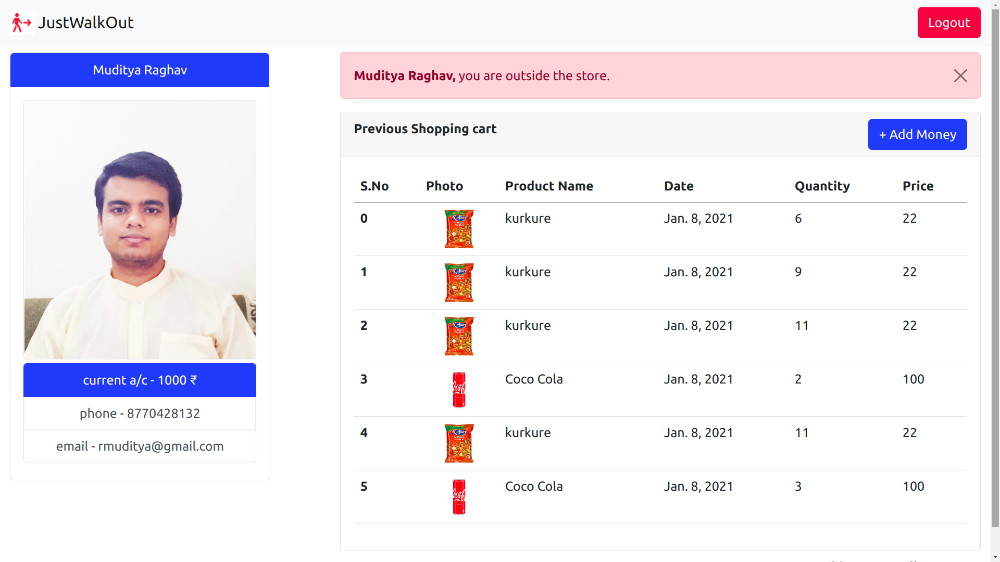
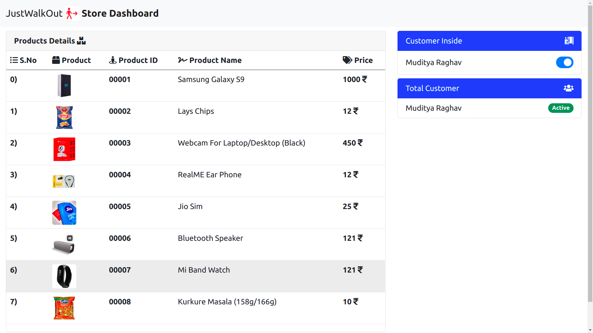
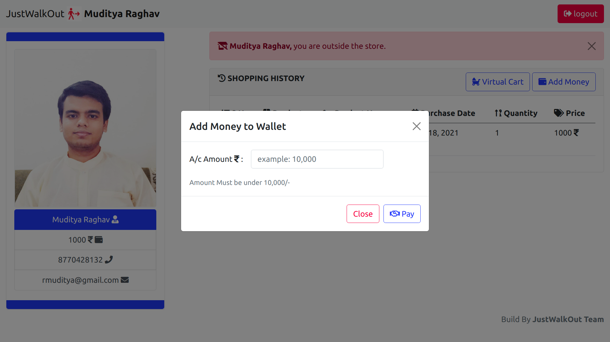
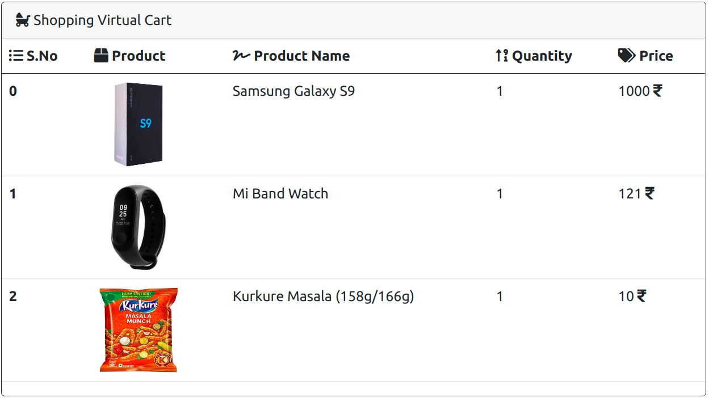
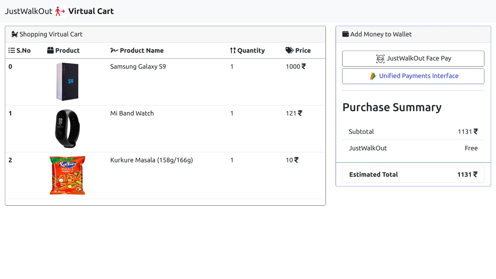
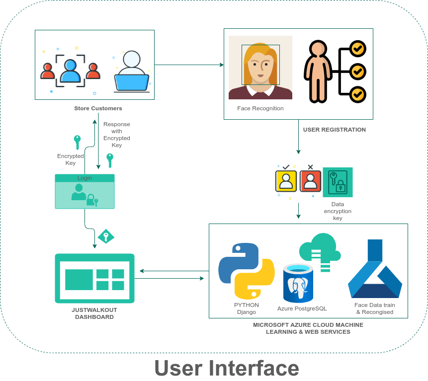
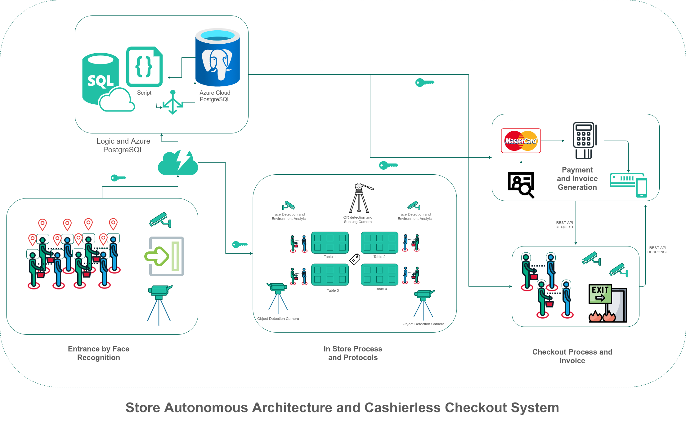
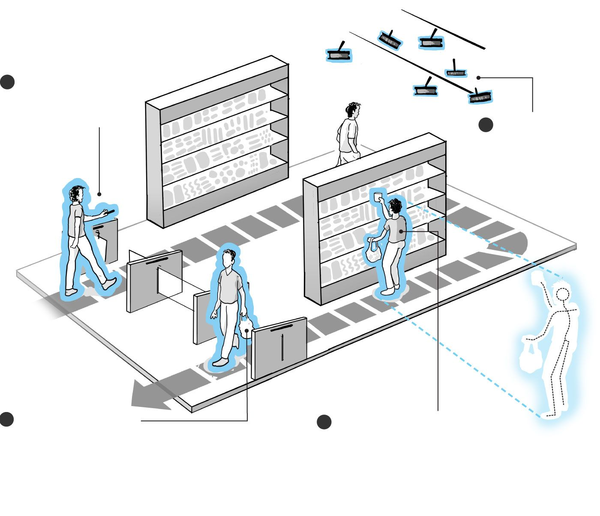

<!-- PROJECT -->
  <h3 align="center">
JUSTWALKOUT - CASHIERLESS CHECKOUT STORE
</h3>

  <p align="center">
  (Imagine Cup, Microsoft 2021)
    <br />
    <a href="https://mudityadev.github.io/mudityadev/"><strong>Muditya Raghav Portflio </strong></a>
  


<!-- TABLE OF CONTENTS -->
<details open="open">
  <summary>Table of Contents</summary>
  <ol>
    <li><a href="#Overview---About-The-Project">Overview - About The Project</a></li>
    <li><a href="#Tools-and-Technique">Tools and Technique</a></li>
    <li><a href="#pipeline">Pipeline</a></li>
    <li>
      <a href="#How-to-Run">How to Run</a>
      <ul>
        <li><a href="#prerequisites">Environment Setup</a></li>
        <li><a href="#installation">Installation of Libraries</a></li>
        <li><a href="#installation">Command on Terminal</a></li>
      </ul>
    </li>
    <li><a href="#More-Screenshots">More Screenshots</a></li>
    <li><a href="#Possible-Improvements">Possible Improvements</a></li>
    <li><a href="#contact">Contact</a></li>
  </ol>
</details>


<!-- ABOUT THE PROJECT -->
## Overview - About The Project
<br />
JUSTWALKOUT store tries to bring the smooth, fast purchasing experience of e-commerce to the retail store – and without the restriction of a payment interface. <br>
 In JUSTWALKOUT, we try to give a totally seamless shopping experience: you can enter by scanning face by face recognition technology backed by AZURE and pick up the product, and JUSTWALKOUT of the store without standing in any queue or boring checkout processes.

<!-- Tools -->
## Tools and Technique

* OpenCV - Computer Vision
* Hashmaps - Cart Management
* Dlib - Face Recoginition Library  
* Django, Python3 - Web Framework
* PostgreSQL - Database Management System  

<!-- Pipeline -->
## Pipeline

* Register the user information and face pattern via webapp and webcam
* User login though webapp and connect bank details
* Enter the Store by face recognition
* Virtual cart is created and CRUD operation perform.
* Checkout via exit door camera and money debit from user accounts
* User can message from platform with invoice
* Dashboard page for setting and managements


## How to Run

1. Windows 10 (64 bit ) or Ubuntu 20.04 or 18.04 (Environment)
2. Clone the repo
```sh
   git clone https://github.com/mudityadev/JUSTWALKOUT-The-Cashierless-Checkout-Store-master.git
   ```
3. Install Requirements
 ```sh
   pip3 install -r requirements
   ```
4. Open Terminal and type
 ```sh
   python manage.py runserver
   ```
5. Open Browser and put the link
 ```sh
   http://127.0.0.1
   ```
<!-- Improvement -->
## More Screenshots
1. Dashboard
   

<br />

1. Registration 
   

<br />

3. Login 
   

<br />

4. Store Dashboard


<br />

5. Add Money in Wallet
   

<br />
6. Virtual Cart


<br />

7. Bill Generate


<br />

8. System Design - Face Recognition


<br />

9. System Design of JUSTWALKOUT


<br />

10. Demonstration Youtube Video, Click down below

[](https://www.youtube.com/watch?v=1L_4T5iMZ4w)


<!-- Improvement -->
## Possible Improvements

1. Check-In and Check-out though QR or Fingerprint 
2. Integrate with UPI
3. 2 factor authenication of checkout


<!-- CONTACT -->
## Contact

Muditya Raghav 
* [Muditya Raghav](https://mudityadev.github.io/mudityadev/)
* [Linkedin](https://www.linkedin.com/in/muditya/)
* [Twitter](https://twitter.com/mudityadev)
* [Gmail - rmuditya@gmail.com](rmuditya@gmail.com)
* [Gmail - mudityadev@gmail.com](mudityadev@gmail.com)

Thank you